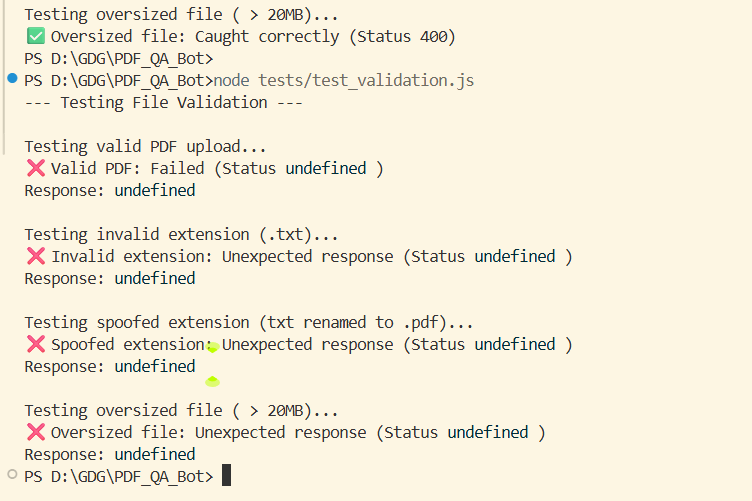

## Team Number : Team 150

## Description
Implemented robust file type and size validation for the PDF upload endpoint to prevent malicious file uploads and server resource exhaustion. Restricted uploads to `.pdf` files with a 20MB limit and added descriptive error handling.

## Related Issue
Closes #file-validation-security

## Type of Change
- [ ] Bug fix (non-breaking change which fixes an issue)
- [x] New feature (non-breaking change which adds functionality)
- [ ] Breaking change (fix or feature that would cause existing functionality to not work as expected)
- [x] Documentation update
- [x] Code refactoring
- [x] Performance improvement
- [ ] Style/UI improvement

## Changes Made
- Updated `multer` configuration in `server.js` with `limits` and `fileFilter`.
- Implemented **Dual Validation**:
    - **MIME type**: Must be `application/pdf`.
    - **Extension**: Must end with `.pdf`.
- Enforced a **20MB** file size cap to protect RAG service RAM.
- Added a dedicated Express error-handling middleware to return `400 Bad Request` with descriptive messages for:
    - Oversized files.
    - Invalid file types (including spoofed extensions).
- Added a verification test script in `tests/test_validation.js`.

## Screenshots (if applicable)



Verification script output:
```
--- Testing File Validation ---
Testing valid PDF upload...
✅ Valid PDF: Success
Testing invalid extension (.txt)...
✅ Invalid extension: Caught correctly (Status 400)
Testing spoofed extension (txt renamed to .pdf)...
✅ Spoofed extension: Caught correctly (Status 400)
Testing oversized file ( > 20MB)...
✅ Oversized file: Caught correctly (Status 400)
```

## Testing
- [x] Tested on Desktop (Chrome/Firefox/Safari)
- [x] Tested on Mobile (iOS/Android)
- [ ] Tested responsive design (different screen sizes)
- [x] No console errors or warnings
- [x] Verification script confirmed correct rejection of malicious and oversized files.

## Checklist
- [x] My code follows the project's code style guidelines
- [x] I have performed a self-review of my code
- [x] I have commented my code where necessary
- [x] My changes generate no new warnings
- [x] I have tested my changes thoroughly
- [x] All TypeScript types are properly defined
- [x] I have read and followed the [CONTRIBUTING.md](CONTRIBUTING.md) guidelines

## Additional Notes
The implementation reject files before they are written to disk if they exceed the size limit or fail the type check, ensuring minimal resource usage during validation.
